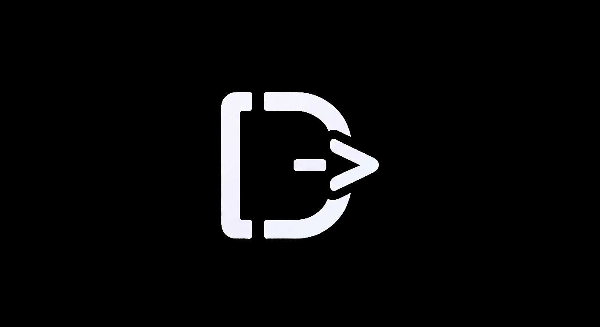
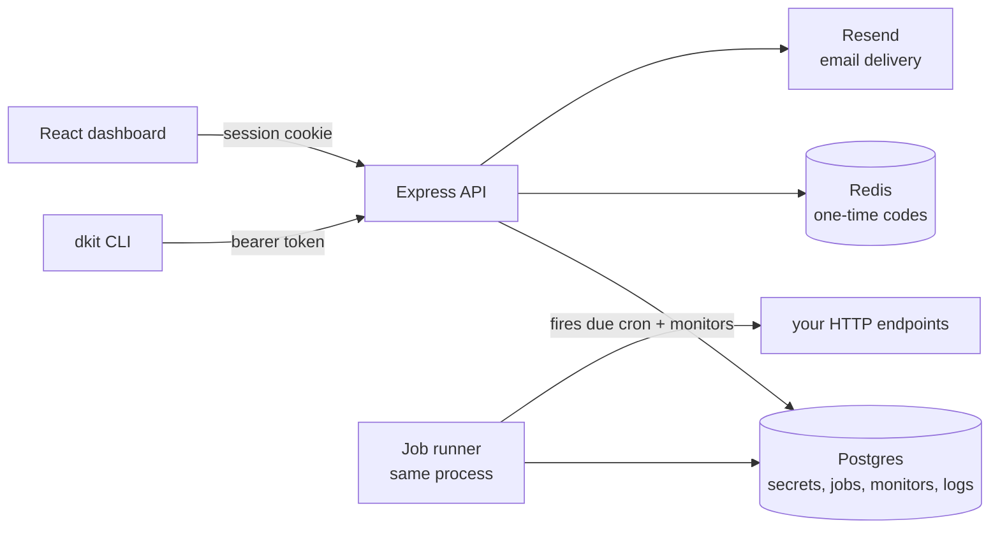

<p align="center">
  
</p>

<h1 align="center">D-Kit</h1>

<p align="center"><strong>Secrets manager, scheduled jobs, uptime checks and a log drain for your projects. Self-hosted, on your own infrastructure. One CLI, one dashboard, one API.</strong></p>

<p align="center">
  
  
  
  
  
  
</p>

---

D-Kit is a toolkit for the boring parts of running side projects: env vars that change between environments, a key-value store your code reads at runtime, cron jobs and uptime monitors that don't need a server that stays awake, and a place for logs to go. Use the `dkit` command, the dashboard, or the plain HTTP API — all three talk to the same backend.

## Install the CLI

```bash
curl -fsSL https://raw.githubusercontent.com/sera0x/D-Kit/main/install.sh | sh
```

The script verifies a SHA-256 checksum before installing and needs only curl, tar and node.

If Node is already part of your stack:

```bash
npm install -g dkit-cli
```

There is no install script in the package, so `npm ci --ignore-scripts` and pnpm's default settings work fine.

## What it does

- **Keys are hashed at rest.** API keys and refresh tokens are stored as SHA-256 hashes and shown exactly once, at creation or rotation. Someone dumping your database gets prefixes, not keys.
- **Environments are first-class.** development, staging, production, or your own names, as separate sets of secrets in one project. `env:diff` shows which keys differ, `env:copy` syncs them, and `env:rollback <key>` restores a previous value.
- **No `.env` file on disk.** `dkit run -- npm start` injects secrets into the process that needs them and exits with that process's own status. `env:pull > .env` exists for when you do want the file.
- **Secrets stay masked by default.** Listing variables never sends values over the wire — the server masks them, and revealing one is an explicit `env:get`. The audit feed records every write, delete and rollback with the actor and source IP.
- **Cron jobs are human strings, not star fields.** `30s`, `5m`, `daily 09:30`, `mon 09:00`, all UTC, with a 10-second floor. The API fires the HTTP calls, keeps run history, and can pause or run a job on demand.
- **Uptime monitors email once, not per check.** You get one message when a URL goes down and one when it recovers. Checks run from 30 seconds up to an hour apart.
- **The log drain takes anything that can POST.** Ship single lines or JSON batches from any app, tail with level and search filters, and let the 7-day retention handle cleanup.
- **A runtime key-value store** handles state that isn't a secret. JSON values, optional TTL, atomic increments. If your code writes it, it goes here; if you deploy it, it's a secret.
- **Teams share projects without sharing accounts.** Owner, admin and member roles, projects shared into a team, invitations that only work for a verified address.
- **Deletes make you type the command.** Projects and secrets confirm through a type-to-confirm prompt, like a terminal, because the destructive action is the point.

## Self-host it in one command

```bash
git clone https://github.com/sera0x/D-Kit.git
cd D-Kit
cp backend/.env.example backend/.env     # fill in the three required values
./scripts/start.sh
```

That brings up the API serving the dashboard on `localhost:3001`. The database schema creates itself on first boot. You need Node 18+, PostgreSQL and Redis running, plus three values in `backend/.env`:

| Variable | What it is |
|---|---|
| `DB_PASSWORD` | Password for the `dkituser` Postgres role |
| `JWT_SECRET` | Signs session tokens — `openssl rand -hex 32` |
| `RESEND_API_KEY` | Sends verification codes, invites and uptime alerts |

OAuth is optional: the Google and GitHub buttons stay hidden until both ID and secret are set. A step-by-step VPS checklist is in [VPS-SETUP.md](VPS-SETUP.md), and [MIGRATION.md](MIGRATION.md) covers moving the whole stack to a new VPS with one archive.

## How it fits together



The CLI and the dashboard are two clients of the same API, and neither one is a special case. The backend serves the built dashboard and the API on one port, and a job runner in the same process claims due cron jobs and probes monitors. Secrets live in Postgres per project and environment, and values only travel to clients that already passed the access check.

## Repository layout

| Path | What it is |
|---|---|
| `backend/` | The Express API, the job runner and the auth flow — the entire backend |
| `website/` | The React dashboard and marketing site, built with Vite |
| `cli/` | The `dkit` CLI, plus project templates for `dkit new` |
| `scripts/` | Start, update, preview and VPS migration scripts |
| `install.sh` | The `curl \| sh` installer for the CLI |
| `VPS-SETUP.md` | Step-by-step VPS setup checklist |
| `MIGRATION.md` | How to move everything to a new VPS with one archive |

## The CLI

| Command | What it does |
|---|---|
| `dkit login` / `dkit logout` | Sign in with email and one-time code; revoke the device session |
| `dkit verify <code>` | Verify your email from the terminal |
| `dkit new <name>` | Scaffold a project from a template and link this folder to it |
| `dkit projects:create <name>` | Create a project, keyless until a key is issued |
| `dkit keys:rotate [name]` | Issue or replace the API key; the old one stops working immediately |
| `dkit env:set <key> <value>` | Set a variable, `-e` picks the environment |
| `dkit env:get <key>` / `dkit env:list` | Read one; list all, masked unless `--show` |
| `dkit env:rollback <key>` | Restore a previous value |
| `dkit env:history <key>` | The audit feed for one key, lengths instead of values |
| `dkit env:diff <a> <b>` / `env:copy <a> <b>` | Compare or sync two environments |
| `dkit env:pull` / `env:push <file>` | Print the environment as `.env`; bulk-set from one |
| `dkit run -- <command>` | Run a command with secrets injected, nothing written to disk |
| `dkit store:set/get/incr` | The runtime store: JSON values, TTL, atomic increments |
| `dkit cron:add <name> <url> -s "daily 03:00"` | Schedule an HTTP call |
| `dkit cron:runs <name>` / `cron:pause` / `cron:rm` | Run history, pause, delete |
| `dkit monitor:add <name> <url>` | Watch a URL; email on down and on recovery |
| `dkit logs:ship` / `logs:tail` | Ship lines or JSON batches; tail with filters |
| `dkit 2fa status / setup / enable / disable` | Manage two-factor auth for your account |
| `dkit doctor [--fix]` | Diagnose the setup and apply the safe fixes |

Full reference lives at `/docs` on your deployment.

## Security, briefly

API keys and refresh tokens are stored as SHA-256 hashes, with the plaintext existing only in the response that issued them. Refresh tokens rotate on every use, so a stolen token dies the next time the real client refreshes. Env listings are masked server-side, env history keeps value lengths instead of values, and one-time codes and invitations are rate-limited.

## License

MIT — see [LICENSE](LICENSE).
